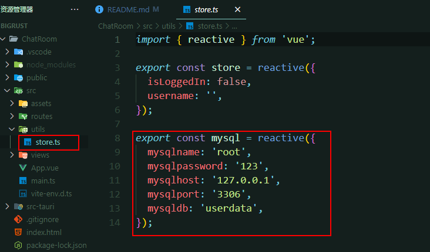
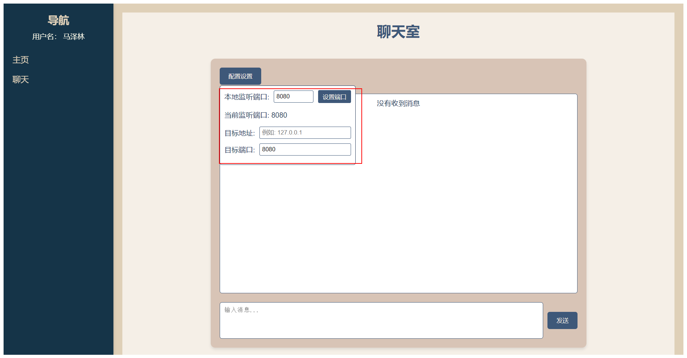
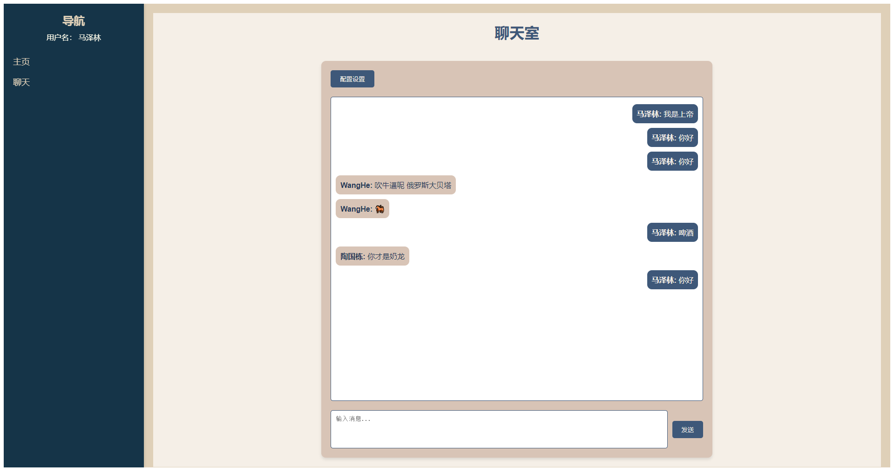

# BigRust

## 启动项目

### 配置环境

#### 配置前端环境

```bash
cd ChatRoom
npm install
```

#### 配置rust环境

```bash
cd src-tauri
cargo build
```

#### 配置数据库

按照你自己的mysql数据库配置，不过首先你要创建一个数据库




### 正式启动

```bash
# 在ChatRoom目录下
npm run tauri dev
```


### 效果如下显示





## 目的

### 利用Rust语言通过UDP协议，实现一个简单的命令行聊天应用。具体要求如下：

- [x] 发送消息：可以通过命令行输入消息并发送给指定的目标。
- [x] 接收消息：实时接收来自其他用户的消息并显示在终端上。
- [x] 本地端口配置：用户可以指定自己的监听端口。
- [x] 目标端口配置：用户可以指定目标地址和端口。
- [x] 多线程处理：发送和接收功能独立运行，互不影响。

### 可选功能（可根据自己情况进行添加）：
- [x] 多用户登录：程序允许使用不同的用户名和密码登录程序，各用户之间相互隔离。
- [ ] 保存历史记录：程序允许保存50条用户与好友的聊天记录，并支持查看聊天记录功能
- [ ] 加密聊天：用户之间的聊天内容经过加密，数据包被捕获也无法解析出原始数据（提示：使用非对称加密算法）
- [x] 聊天组：用户可以加入到不同的聊天组中，聊天组中发送消息，在线的其他人都能看到
- [x] 告别命令行：制作一个简单的HTML界面或本地GUI应用，将聊天室功能使用图形界面来展示
- [x] 发送文件：用户之间可以互相发送文件

## 项目分工

### 用户登录与保存历史记录

我， 赫， 世明， 

### 聊天组，发送文件，加密聊天（这个看看能不能做吧）
俊 志博 际远

## 文档分工

### 视频剪辑
赫

### 项目文档整理
世明

### 需求分析

志博

### 实验步骤及结果

赫，际远

### 数学模型

际远

### 解决方案（注意创新点）

志博

### 技术路线

世明

### 时间空间复杂度

俊

### 每个成员发挥的作用

我

### 从项目习得的知识

俊


